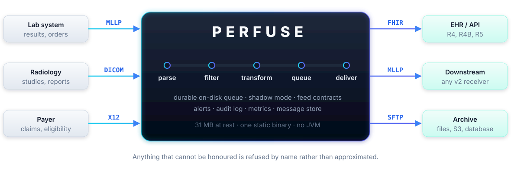
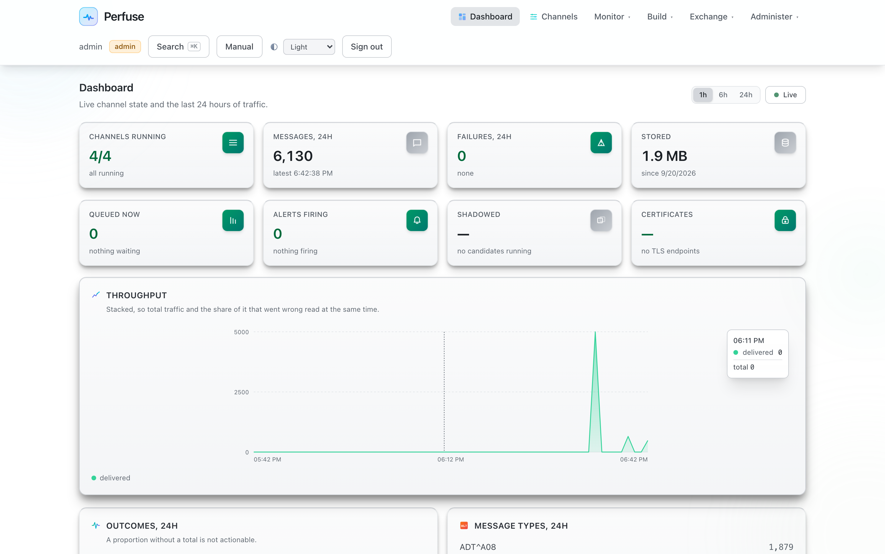
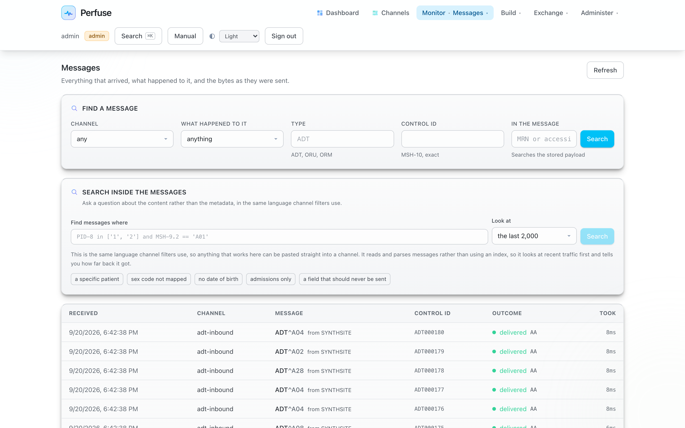
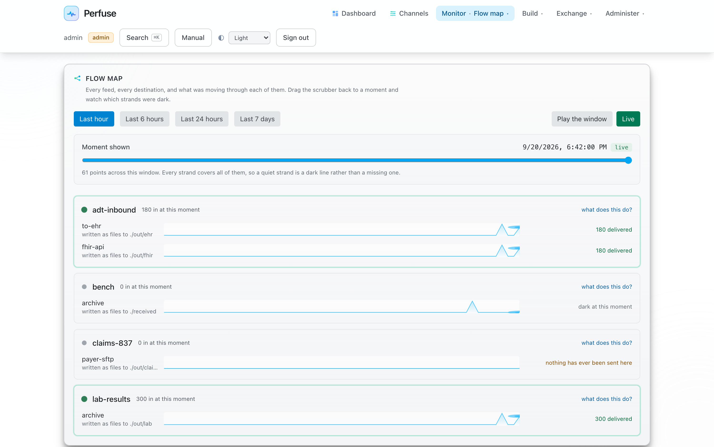
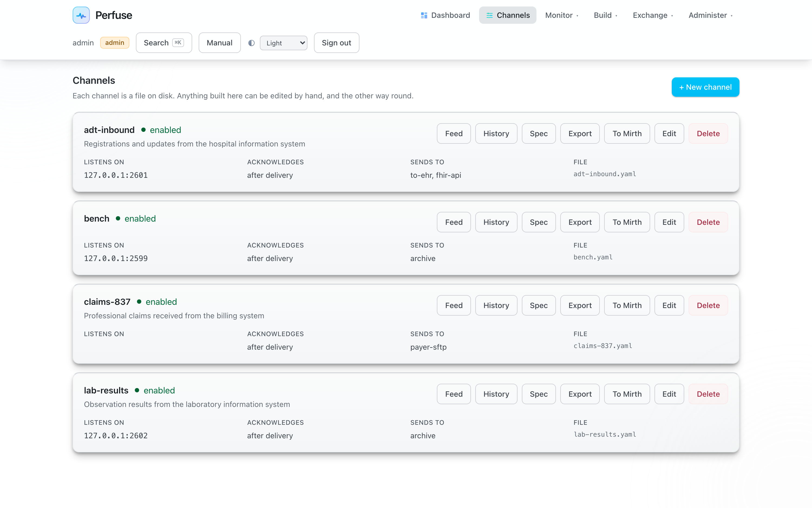
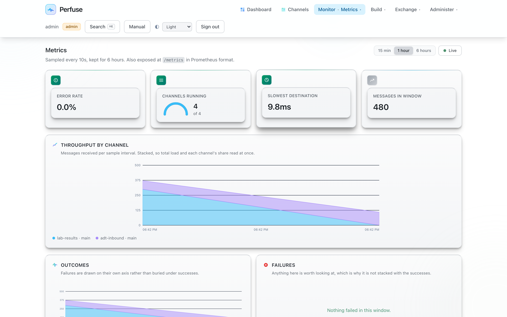
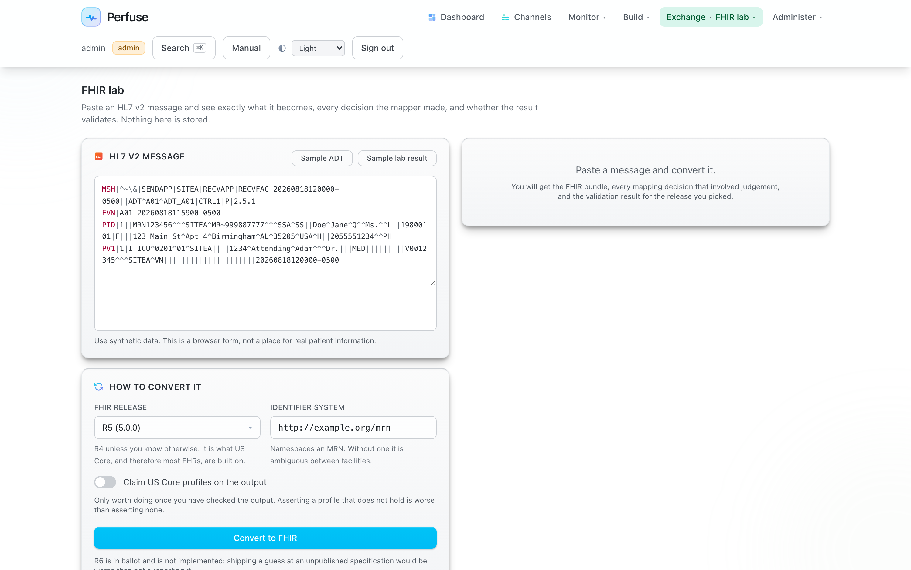

<div align="center">


<h1></h1>

### Open-source healthcare integration engine — HL7 v2, FHIR, DICOM, X12 and CDA in one static binary

**A modern, Apache-2.0 licensed alternative to Mirth Connect.** No JVM. No installer. No paid licence.
Your existing Mirth JavaScript runs unchanged.

**31 MB of memory at rest, against Mirth's 383 MB** — measured on the same machine, both idle. One file to copy
instead of a 254 MB install and a Java runtime, and it starts immediately rather than warming up.

[](LICENSE) [](https://go.dev) [](#download) [](#download) [](#verified-against-real-software-not-mocks)

### Download v0.1.3

<a href="https://github.com/biodream-llc/perfuse/releases/download/v0.1.3/perfuse-v0.1.3-linux-amd64.tar.gz"></a>&nbsp;&nbsp;&nbsp;<a href="https://github.com/biodream-llc/perfuse/releases/download/v0.1.3/perfuse-v0.1.3-darwin-arm64.tar.gz"></a>&nbsp;&nbsp;&nbsp;<a href="https://github.com/biodream-llc/perfuse/releases/download/v0.1.3/perfuse-v0.1.3-windows-amd64.zip"></a>

<sub>One file, nothing to install. [Intel Macs, ARM64 Linux, ARM64 Windows and checksums](#download)</sub>

[**Quick start**](#quick-start) · [**Why Perfuse**](#why-perfuse-exists) ·
[**Mirth migration**](#migrating-from-mirth-connect) · [**Everything it does**](#everything-it-does) ·
[**Manual**](docs/manual/perfuse-manual.html) · [**Reference**](docs/reference.md) · [**FAQ**](#faq)

</div>

---

## What is Perfuse?

**Perfuse is an open-source healthcare integration engine** — an interface engine — for moving clinical data
between systems that were never designed to talk to each other. A lab sends results in HL7 v2, an imaging
department speaks DICOM, a payer sends X12, and the receiving system wants FHIR. Perfuse sits in the middle,
parses each of them properly, transforms what needs transforming, and delivers without losing anything.

**What it reads and writes:** HL7 v2 · FHIR R4, R4B and R5 · DICOM · X12 837, 835, 270/271 and 278 ·
C-CDA and CDA · HL7 v3 · delimited and raw formats.

**How it connects:** MLLP, TCP, HTTP, SOAP, files, FTP, SFTP, SMB, WebDAV, databases, DICOM, message brokers
and S3 — fourteen source types and seventeen destination types, in both directions.

**What it does beyond moving messages.** A **durable on-disk queue** that keeps ordering and survives a
restart. **Shadow mode**, so a channel can be changed against real traffic while delivering nothing.
**Feed contracts** that tell you when a sender quietly changes something. **TEFCA and UDAP** for exchanging
records with organisations you have no direct connection to. **Prior authorisation** to payer FHIR APIs for
CMS-0057. **eCR and ELR** public health reporting. **SAML, OpenID Connect, LDAP, passkeys, SCIM and mutual
TLS** for sign-on. Metrics, alerting, tracing, an audit log, and a searchable message store.

**And it is one file.** Written in Go, licensed under **Apache 2.0**, running on **Linux, macOS and Windows**
with nothing installed beside it — no Java runtime, no application server, no database to stand up first. The
web console is compiled into the binary, and **everything the configuration files can express can also be done
from the browser.** That is a rule this project holds itself to, not an aspiration: a feature reachable only
from YAML is treated as a bug.



## Everything it does

Fifteen areas, itemised. Nothing here is aspirational: where a capability is partial it says so, and where it
depends on something outside this software that is stated too.

<table width="100%">
<thead><tr><th align="left" valign="middle" width="176"></th><th align="left" valign="middle">Parse, route, transform, generate, acknowledge</th></tr></thead>
<tbody>
<tr><td colspan="2">A parser that <b>indexes rather than decodes</b>, so reading one field does not rebuild the message</td></tr>
<tr><td colspan="2">Segments, fields, repetitions, components and subcomponents, with <b>custom Z-segments</b> and non-standard separators</td></tr>
<tr><td colspan="2">Escape sequences handled properly, including embedded delimiters and hex escapes</td></tr>
<tr><td colspan="2"><b>MLLP</b> in both directions with TLS, plus TCP, HTTP and file transports</td></tr>
<tr><td colspan="2">A <b>field dictionary</b> so the interface says "the patient's family name" rather than <code>PID-5.1</code></td></tr>
<tr><td colspan="2">Acknowledgement generation with <code>AA</code> / <code>AE</code> / <code>AR</code>, <b>enhanced mode</b>, and control over <i>when</i> the ack is sent — after delivery by default, so a sender is never told "received" before it is true</td></tr>
<tr><td colspan="2"><code>perfuse generate</code> makes synthetic traffic; <code>perfuse deident</code> turns real messages into a corpus you can share</td></tr>
<tr><td colspan="2">Usable as a <b>standalone Go library</b> (<code>github.com/biodream-llc/perfuse/hl7</code>) with no dependency on the engine</td></tr>
</tbody></table>

<table width="100%">
<thead><tr><th align="left" valign="middle" width="176"></th><th align="left" valign="middle">R4, R4B and R5 — mapper, REST server, validator, destination type</th></tr></thead>
<tbody>
<tr><td colspan="2"><b>An HL7 v2 to FHIR mapper</b>, not a bolt-on: <code>ADT</code> becomes Patient and Encounter, <code>ORU</code> becomes Observation and DiagnosticReport, with the date and code conversions done properly</td></tr>
<tr><td colspan="2"><b>A FHIR REST server</b> you can point a client at — search parameters, bundles, transactions, references</td></tr>
<tr><td colspan="2"><b><code>fhir</code> as a destination type</b>, so a v2 feed can deliver to a FHIR API directly</td></tr>
<tr><td colspan="2">Validation against the specification, and a <b>browser FHIR lab</b> for pasting v2 in and reading the FHIR out</td></tr>
<tr><td colspan="2">Bulk export, and <code>perfuse fhir</code> for converting, validating and serving from the command line</td></tr>
<tr><td colspan="2">Verified against <b>a real HAPI FHIR server</b>, which caught an identifier system this code was fabricating</td></tr>
</tbody></table>

<table width="100%">
<thead><tr><th align="left" valign="middle" width="176"></th><th align="left" valign="middle">All five services, both directions, with de-identification</th></tr></thead>
<tbody>
<tr><td colspan="2"><b>C-STORE, C-FIND, C-ECHO, C-MOVE and C-GET</b> — sending and receiving</td></tr>
<tr><td colspan="2">A <b>DICOM query source</b>: schedule a C-FIND and turn each result into a message</td></tr>
<tr><td colspan="2"><b>De-identification as a pipeline step</b> — remove the patient, strip private tags, set the AE title</td></tr>
<tr><td colspan="2">Window and frame selection, and metadata extraction into tags a filter can read</td></tr>
<tr><td colspan="2">Studies converted into observations that travel onward as <b>HL7 v2 or FHIR</b></td></tr>
<tr><td colspan="2">Verified against <b>a real Orthanc PACS</b>: the instance arrives and the patient name, identifier, study date, modality and SOP class all survive. The assertion is Orthanc's own catalogue, not the absence of an error</td></tr>
</tbody></table>

<table width="100%">
<thead><tr><th align="left" valign="middle" width="176"></th><th align="left" valign="middle">837, 835, 270/271, 278 — parsed structurally, not as text</th></tr></thead>
<tbody>
<tr><td colspan="2"><b>837</b> professional and institutional claims, <b>835</b> remittance advice, <b>270/271</b> eligibility, <b>278</b> prior authorisation</td></tr>
<tr><td colspan="2">Interchange, functional group, transaction set, loops, segments and qualifiers understood as a <b>structure</b> — not split on delimiters and hoped over</td></tr>
<tr><td colspan="2">An X12-to-XML representation for transformation, and back again</td></tr>
<tr><td colspan="2"><b>Da Vinci prior authorisation mapped to and from the X12 278 transaction</b>, which is what CMS-0057 requires</td></tr>
<tr><td colspan="2">Acknowledgement is not synchronous, and Perfuse says so rather than pretending: X12 uses a 997 or 999 sent separately</td></tr>
</tbody></table>

<table width="100%">
<thead><tr><th align="left" valign="middle" width="176"></th><th align="left" valign="middle">C-CDA and CDA, including the ones hidden inside v2 messages</th></tr></thead>
<tbody>
<tr><td colspan="2">Read, validate and convert <b>C-CDA and CDA</b>, including documents arriving <b>base64-encoded inside an <code>MDM^T02</code></b>, which is how they usually turn up</td></tr>
<tr><td colspan="2"><b>The narrative text is compared against the coded entries.</b> A document whose human-readable section disagrees with its structured data is flagged. Nothing else does this</td></tr>
<tr><td colspan="2">Document templates identified and reported by name</td></tr>
<tr><td colspan="2">Signing and verification, repair of malformed documents, and PDF rendering</td></tr>
<tr><td colspan="2">A <b>document destination type</b>, and a browser lab for inspecting one</td></tr>
</tbody></table>

<table width="100%">
<thead><tr><th align="left" valign="middle" width="176"></th><th align="left" valign="middle">16 source types, 18 destination types, in both directions</th></tr></thead>
<tbody>
<tr><td colspan="2"><b>Sources:</b> MLLP · TCP · HTTP · SOAP · file · FTP · SFTP · SMB · WebDAV · database · DICOM · DICOM query (C-FIND) · <b>Kafka</b> · message broker (STOMP) · JavaScript Reader · serial</td></tr>
<tr><td colspan="2"><b>Destinations:</b> MLLP · TCP · HTTP · SOAP · SMTP · file · FTP · SFTP · S3 · database · DICOM · FHIR · CDA · document · JavaScript · <b>Kafka</b> · message broker (STOMP) · another channel</td></tr>
<tr><td colspan="2">Databases: <b>PostgreSQL, MySQL, SQL Server, Oracle and SQLite</b>, with the dialect checked when the channel is saved rather than at three in the morning</td></tr>
<tr><td colspan="2"><b>Kafka</b>, keyed so one patient's events stay in order while different patients go in parallel — Kafka orders within a partition and nowhere else, and records sharing a key always share one. Offsets commit <b>after</b> a batch is handled, so a crash redelivers rather than loses</td></tr>
<tr><td colspan="2">A <b>channel destination</b> so one feed can hand off to another without a network round trip</td></tr>
<tr><td colspan="2">A <b>fleet view</b> for a site running more than one instance — every channel on every server in one table, with a rollup that counts <b>undetermined</b> separately from <b>unreachable</b>, because a screen of zeros looks like health. Peers are read with a token they issue themselves, and the report between instances carries counts only: no message identifiers, no patient data. Mirth charges for this</td></tr>
<tr><td colspan="2">SFTP verified against <b>OpenSSH</b>, databases against <b>real PostgreSQL</b>, mutual TLS against <b>OpenSSL</b> — a client and server from the same library agreeing only proves they agree with each other</td></tr>
</tbody></table>

<table width="100%">
<thead><tr><th align="left" valign="middle" width="176"></th><th align="left" valign="middle">Eleven declarative steps, or full JavaScript when you need it</th></tr></thead>
<tbody>
<tr><td colspan="2">Declarative steps that need no code: <b>set, copy, remove, clear, default, case, date, pad, trim, replace, map</b> — each with an optional <code>when</code> condition</td></tr>
<tr><td colspan="2"><b>Shared mapping tables</b> that outlive the channel that first needed one, with a record of who decided each mapping and why</td></tr>
<tr><td colspan="2"><b>Code sets</b> and value-set lookups</td></tr>
<tr><td colspan="2"><b>Attachment extraction</b>: move a large payload out of a message and put it back on the way out</td></tr>
<tr><td colspan="2">Full JavaScript for the rest — including <b>the Mirth dialect</b>, E4X and all</td></tr>
<tr><td colspan="2">Three defaults chosen against convenience: an unmapped code is <b>kept</b> rather than blanked, a date that does not match its stated format <b>stops the message</b>, and padding an empty field <b>does nothing</b> rather than inventing an identifier</td></tr>
</tbody></table>

<table width="100%">
<thead><tr><th align="left" valign="middle" width="176"></th><th align="left" valign="middle">A durable queue that does not lose messages</th></tr></thead>
<tbody>
<tr><td colspan="2"><b>A durable on-disk queue per destination</b>, so one slow receiver does not hold up the others</td></tr>
<tr><td colspan="2"><b>Order is preserved</b>: message 2 is not attempted before message 1 succeeds or is given up on</td></tr>
<tr><td colspan="2">Retries with exponential backoff, configurable attempts, and <b>dead-lettering that keeps the message</b>. Nothing is deleted to make a queue look healthy</td></tr>
<tr><td colspan="2">A queue you can inspect, retry, skip and drain from the interface</td></tr>
<tr><td colspan="2">Survives restart, because it is on disk rather than in memory</td></tr>
<tr><td colspan="2">Acknowledge <b>after</b> delivery by default, so an upstream sender is not told a message is safe before it is</td></tr>
</tbody></table>

<table width="100%">
<thead><tr><th align="left" valign="middle" width="176"></th><th align="left" valign="middle">SAML, OIDC, LDAP, passkeys, SCIM, mutual TLS</th></tr></thead>
<tbody>
<tr><td colspan="2"><b>SAML 2.0</b>, verified end to end against <b>a real Keycloak 26 and a real Microsoft Entra tenant</b>. Configure it by pasting the provider's metadata — no hunting for a certificate in XML and stripping its line breaks</td></tr>
<tr><td colspan="2"><b>OpenID Connect</b>, with discovery, and <b>LDAP / Active Directory</b></td></tr>
<tr><td colspan="2"><b>Passkeys (WebAuthn)</b> — fingerprint, face or a security key, and nothing a fake login page can capture</td></tr>
<tr><td colspan="2"><b>SCIM 2.0</b>, so an identity provider can provision and deprovision accounts directly</td></tr>
<tr><td colspan="2"><b>Mutual TLS</b>, verified against <b>OpenSSL</b> rather than against our own client</td></tr>
<tr><td colspan="2">Role-based access control, API tokens for machines, session management, and an <b>audit log of who changed what</b></td></tr>
<tr><td colspan="2">Refuses to serve patient data over plain HTTP on a non-loopback address unless explicitly overridden</td></tr>
<tr><td colspan="2">A rate limiter on authentication, and PHI access auditing with volume, after-hours and bulk-access detection</td></tr>
</tbody></table>

<table width="100%">
<thead><tr><th align="left" valign="middle" width="176"></th><th align="left" valign="middle">UDAP, Facilitated FHIR, and the auditing TEFCA requires</th></tr></thead>
<tbody>
<tr><td colspan="2">This is the part that lets hospitals share records with organisations they have no direct connection to.</td></tr>
<tr><td colspan="2"><b>UDAP</b> — dynamic client registration, discovery, and <b>signed metadata verification</b>, checked against a real authorisation server and a real trust community</td></tr>
<tr><td colspan="2"><b>Facilitated FHIR exchange</b> between TEFCA participants, following the SOP</td></tr>
<tr><td colspan="2"><b>Every exchange is audited</b>, persisted to disk rather than held in memory — TEFCA does not treat auditing as optional and neither does this</td></tr>
<tr><td colspan="2">Partner discovery with certificate chain verification</td></tr>
<tr><td colspan="2">The real server refused our client <b>on trust-community membership rather than on the form of the request</b>, which is the distinction that matters: a server rejecting malformed requests would say nothing about whether the signed metadata was right</td></tr>
</tbody></table>

<table width="100%">
<thead><tr><th align="left" valign="middle" width="176"></th><th align="left" valign="middle">CMS-0057: Da Vinci PAS, X12 278, payer FHIR APIs</th></tr></thead>
<tbody>
<tr><td colspan="2">Submits prior authorisation requests to <b>payer FHIR APIs</b>, which CMS-0057 requires</td></tr>
<tr><td colspan="2">Maps <b>Da Vinci PAS to and from the X12 278</b> transaction, so a payer on either side is reachable</td></tr>
<tr><td colspan="2">Tracks a request through to its determination rather than firing and forgetting</td></tr>
</tbody></table>

<table width="100%">
<thead><tr><th align="left" valign="middle" width="176"></th><th align="left" valign="middle">eCR and ELR</th></tr></thead>
<tbody>
<tr><td colspan="2"><b>Electronic case reporting (eCR)</b> and <b>electronic lab reporting (ELR)</b></td></tr>
<tr><td colspan="2">Reportable-condition triggering, so a message is submitted because it met a rule rather than because somebody remembered</td></tr>
</tbody></table>

<table width="100%">
<thead><tr><th align="left" valign="middle" width="176"></th><th align="left" valign="middle">Shadow mode, feed contracts, drift detection</th></tr></thead>
<tbody>
<tr><td colspan="2"><b>Shadow mode</b>: run a candidate version of a channel beside the live one <b>on real traffic</b>, delivering nothing, and read exactly where the two differ field by field. This is how you change a working interface without guessing</td></tr>
<tr><td colspan="2"><b>Feed contracts</b>: declare what a feed is supposed to contain — which fields, which code sets, which cardinalities — and be told when reality drifts. Most interface outages are a sender quietly changing something</td></tr>
<tr><td colspan="2"><code>perfuse profile</code> reports what is <b>actually</b> in a feed, and what changed</td></tr>
<tr><td colspan="2"><code>perfuse compare</code> proves two engines agree over the same traffic, or says precisely where they do not</td></tr>
<tr><td colspan="2">Channel history read from git, so you can see what changed and when</td></tr>
</tbody></table>

<table width="100%">
<thead><tr><th align="left" valign="middle" width="176"></th><th align="left" valign="middle">Dashboard, metrics, alerts, tracing, message store, fleet</th></tr></thead>
<tbody>
<tr><td colspan="2">A <b>live dashboard</b>, and a <b>flow map</b> with a scrubber — drag it back to a moment and see which strands were dark</td></tr>
<tr><td colspan="2"><b>Metrics</b> with percentiles, exposed for <b>Prometheus</b></td></tr>
<tr><td colspan="2"><b>Alerts</b> that tell you rather than waiting to be found. Eleven rule kinds: error rate, no traffic, <b>below rhythm</b> (a feed quieter than its own history, which catches a half-broken sender that a threshold misses), channel down, queue depth, queue age, queue stuck, slow delivery, script errors, rows quarantined, and contract violations</td></tr>
<tr><td colspan="2"><b>Distributed tracing</b> exported over OTLP</td></tr>
<tr><td colspan="2">A <b>message store</b> with retention, full search, and search <i>inside</i> message content using the same expression language channels filter with — so anything that works in the search box can be pasted into a channel</td></tr>
<tr><td colspan="2"><b>Find a patient's messages by typing what you know</b> — an MRN, a name, a date of birth, an accession or a claim number — across <b>HL7 v2, FHIR, DICOM and X12 at once</b>, without naming a field in any of them. Matched however it is written, so a message holding <code>SAMPLESON^BRAVO</code> is found by typing <i>Sampleson, Bravo</i>. An index lookup rather than a scan, switchable off, and every search is written to the audit trail with the term</td></tr>
<tr><td colspan="2">Replay and reprocessing, because the message is stored <b>as received</b> before anything modifies it</td></tr>
<tr><td colspan="2"><b>Fleet view</b> across multiple instances, and <b>multi-tenancy</b> with isolation rules</td></tr>
<tr><td colspan="2">Runs as a <b>systemd unit, a launchd service or a Windows service</b>; <code>perfuse init</code> writes the right one</td></tr>
</tbody></table>

<table width="100%">
<thead><tr><th align="left" valign="middle" width="176"></th><th align="left" valign="middle">Both directions, verified against a real Mirth</th></tr></thead>
<tbody>
<tr><td colspan="2"><b>Existing Mirth JavaScript runs unchanged</b> — E4X, <code>msg['PID']['PID.5']['PID.5.1']</code>, <code>for each</code>, XML literals, <code>channelMap</code>, <code>$()</code>, <code>DateUtil</code>, <code>SerializerFactory</code></td></tr>
<tr><td colspan="2"><code>perfuse explain</code> reads a Mirth channel export and says <b>by name</b> what converts, what converts with caveats, and what does not convert at all — before you commit to anything</td></tr>
<tr><td colspan="2"><code>perfuse translate</code> converts the export into Perfuse channels, not a report about them</td></tr>
<tr><td colspan="2"><b>And you can export back.</b> A channel built here can be written as a Mirth channel file, and <b>a real Mirth server accepts it.</b> Ten transport pairs verified by importing into a running Mirth</td></tr>
<tr><td colspan="2">What cannot convert is <b>refused by name rather than approximated</b>. Filters, transformations, contracts and shadow comparisons have nowhere to live in Mirth's format, and each is listed before the file is offered</td></tr>
<tr><td colspan="2">A <b>lock-in audit</b> of Java dependencies in your existing channels, so you know what is holding you in place</td></tr>
</tbody></table>

## How small it is

Measured on one machine, both products idle, then Perfuse again after real traffic. Not a throughput benchmark —
just what each one costs you to have running.

| | Perfuse | Mirth Connect 4.5.2 |
|---|---|---|
| **Memory at rest** | **31 MB** | **383 MB** |
| Memory after 5,000 messages | 46 MB | — |
| CPU when idle | 0.0% | 0.1–0.3% |
| What you install | **one file** | a 254 MB application **plus a JVM** |
| Runtime to install first | none | OpenJDK 17 |
| Processes | 1 | JVM + application server |

About **twelve times less memory** at rest, and nothing to install underneath it. Mirth's figure is the JVM's
resident size and is configurable; the point is not that the number is fixed but that there is a JVM there at all.

**Download size:** ~20 MB per platform. **Binary:** 61 MB, of which 26 MB is the in-browser playground — so the
engine, every connector, the parser and the whole web console together are about 35 MB.

Startup is immediate rather than a warm-up: no JVM to boot, no JIT to reach steady state, no application server
to deploy into. Restarting a channel is not an event you schedule.

### Who it is for

- Integration teams running **HL7 v2 interfaces** who want the engine's source and no licence renewal
- Sites on **Mirth Connect 4.5.2 or earlier**, now unable to take upstream fixes
- Anyone building **FHIR APIs** on top of existing v2 feeds
- Labs, imaging centres, payers and health systems who need **X12**, **DICOM** or **CDA** alongside v2

---

## Download

**Version 0.1.0** — single binary, nothing to install. Each archive contains the executable, the licence,
the notice and the full PDF manual.

| Platform | Architecture | Download |
|---|---|---|
| **Windows** | x64 (Intel/AMD) | [`perfuse-v0.1.3-windows-amd64.zip`](https://github.com/biodream-llc/perfuse/releases/download/v0.1.3/perfuse-v0.1.3-windows-amd64.zip) |
| **Windows** | ARM64 | [`perfuse-v0.1.3-windows-arm64.zip`](https://github.com/biodream-llc/perfuse/releases/download/v0.1.3/perfuse-v0.1.3-windows-arm64.zip) |
| **macOS** | Apple Silicon (M1–M4) | [`perfuse-v0.1.3-darwin-arm64.tar.gz`](https://github.com/biodream-llc/perfuse/releases/download/v0.1.3/perfuse-v0.1.3-darwin-arm64.tar.gz) |
| **macOS** | Intel | [`perfuse-v0.1.3-darwin-amd64.tar.gz`](https://github.com/biodream-llc/perfuse/releases/download/v0.1.3/perfuse-v0.1.3-darwin-amd64.tar.gz) |
| **Linux** | x86-64 | [`perfuse-v0.1.3-linux-amd64.tar.gz`](https://github.com/biodream-llc/perfuse/releases/download/v0.1.3/perfuse-v0.1.3-linux-amd64.tar.gz) |
| **Linux** | ARM64 / aarch64 | [`perfuse-v0.1.3-linux-arm64.tar.gz`](https://github.com/biodream-llc/perfuse/releases/download/v0.1.3/perfuse-v0.1.3-linux-arm64.tar.gz) |

**Verify what you downloaded** against [`SHA256SUMS`](https://github.com/biodream-llc/perfuse/releases/download/v0.1.3/SHA256SUMS):

```sh
shasum -a 256 -c SHA256SUMS --ignore-missing     # macOS / Linux
```

A CycloneDX software bill of materials ships with every release as `perfuse.cdx.json`, and any build can
produce its own with `perfuse sbom -json`.

<details>
<summary><b>Other ways to install</b></summary>

```sh
# Go 1.23 or newer
go install github.com/biodream-llc/perfuse/cmd/perfuse@latest

# Container — the Dockerfile is scratch-based, nothing inside but the binary
docker build -t perfuse . && docker run -p 8080:8080 perfuse

# From source
git clone https://github.com/biodream-llc/perfuse && cd perfuse && make build
```

The Linux binaries are statically linked and verified to run on Alpine, so they need no glibc and work in
`scratch` and distroless images.

</details>

---

## What it looks like

Everything below is the interface that ships inside the binary. There is no separate application to deploy.

**Dashboard** — live channel state and the last 24 hours, with the share of traffic that went wrong readable at
the same time as the total.



**Messages** — every message that arrived, what happened to it, and the bytes as they were sent. The filter box
takes the same expression language channels use, so anything that works here can be pasted straight into a channel.



**Flow map** — every feed and destination on one page, with a scrubber. Drag it back to a moment and see which
strands were dark.



**Channels** — each channel is a file on disk. Anything built in the browser can be edited by hand, and the other
way round. `To Mirth` writes a Mirth channel file that a real Mirth server accepts.



**Metrics** — volumes, timings and error rates over time, with percentiles, exposed to Prometheus as well.



**FHIR lab** — paste HL7 v2, see the FHIR it becomes, and validate it. The same conversion the `fhir` destination
type uses.



## Quick start

```sh
# 1. Start the console. The web interface is inside the binary.
perfuse serve

# 2. Open http://127.0.0.1:8080 and build a channel in the browser.
```

That is the whole installation. There is no separate web application to deploy and no assets directory to
point at.

`perfuse init` will lay out the directories, write a working example channel and generate a service
definition for your operating system — a systemd unit, a launchd plist or a Windows service.

To run a channel from the command line instead:

```sh
# Listen for HL7 v2 over MLLP and write each message to a file
cat > labs.yaml <<'YAML'
name: labs
description: Accepts HL7 v2 over MLLP and files each message

source:
  type: mllp
  # Localhost only. MLLP has no authentication or encryption of its own.
  listen: 127.0.0.1:2575

destinations:
  - name: archive
    type: file
    # One file per day per message type, appended. So five ADT messages of two
    # kinds produce two files, not five.
    dir: ./received
YAML

# Check it before running it
perfuse check labs.yaml

# Run it
perfuse run labs.yaml

# In another terminal, send it synthetic traffic
perfuse generate -n 5 -send 127.0.0.1:2575
```

**Everything in the configuration files can also be done from the web interface.** That is a rule this
project holds itself to, not an aspiration — a feature reachable only from YAML is treated as a bug.

---

## Why Perfuse exists

**In March 2025, NextGen Healthcare closed Mirth Connect's source.** From version 4.6 a paid licence is
required. Version 4.5.2 remains available under the Mozilla Public License, which means every site still
running it is on a release that will never receive another upstream fix — including security fixes.

That leaves a real problem. Mirth Connect runs a very large share of the HL7 interfaces in production
today, those interfaces work, and the people who maintain them did not choose this. Rewriting them is not
a weekend's work, and paying to keep receiving patches for software you already deployed is a different
proposition from the one you originally accepted.

Perfuse is a way out that does not require a rewrite:

- **Your Mirth JavaScript runs unchanged**, E4X and all — `msg['PID']['PID.5']['PID.5.1']`, `for each`,
  XML literals, `channelMap`, `$()`, `DateUtil`, `SerializerFactory`
- **`perfuse translate` converts Mirth channel exports into Perfuse channels**, not just a report saying
  what it found
- **`perfuse explain`** reads a Mirth export and says plainly what would block a migration, before you
  start
- **Shadow mode** runs the converted channel beside the original on real traffic and shows exactly where
  the two disagree — while only the original delivers anything
- **You can export back to Mirth.** A channel built in Perfuse can be written as a Mirth channel file, and
  a real Mirth server accepts it. Leaving is as supported as arriving.

The last point is deliberate. An engine you cannot leave is the problem, not the solution.

---

## Verified against real software, not mocks

Most integration tooling is tested against its own idea of what the other side does. That is how a product
ends up with a hundred passing tests and a feature that has never once worked against the real thing.

Perfuse is verified against actual running software. What was checked, against which versions, and what
it found is recorded in [docs/verification.md](docs/verification.md):

| Verified against | What it proved |
|---|---|
| **Mirth Connect 4.5.2** (real server) | Channels Perfuse exports are accepted and deploy. Found four faults the exporter's own nine passing tests could not see — Mirth stores an invalid channel and *returns success* |
| **Keycloak 26** | SAML sign-in end to end. Found a signature-canonicalisation defect a thousand self-written tests had missed |
| **Microsoft Entra ID** (real tenant) | SAML sign-in with a real Microsoft account, including an interactive browser sign-in. Found five behaviours no reading of the specification predicts |
| **HAPI FHIR** | FHIR resources Perfuse produces validate in an independent server |
| **Orthanc** | DICOM C-STORE and C-FIND against a real PACS |
| **PostgreSQL, SFTP, ActiveMQ** | Database, file transfer and broker destinations against real services |
| **The FHIR R4 specification's own examples** | All 2,912 example files the standard's authors published. 13,723 resources validated, none reported wrongly. Found a bundle whose invalid content was being reported as a missing feature, exiting zero under `-strict` |
| **The HAPI HL7 v2 test corpus** | 59 of the reference Java implementation's own awkward messages — uuencoded payloads, escaped delimiters, repeating groups — all parsed |
| **SIGKILL, mid-batch** | 255 messages acknowledged across five hard kills, 255 present downstream, none lost and none duplicated. The numbers for the weaker acknowledgement mode are published too |

Interoperability tests run against containers, not stubs. Where a real product's behaviour contradicted
the specification, the real behaviour won and a fixture recording it was committed.

---

---

## Migrating from Mirth Connect

```sh
# 1. What would stop you, before you commit to anything
perfuse explain mirth-channel-export.xml

# 2. Convert it
perfuse translate mirth-channel-export.xml -o channels/

# 3. Test it against sample messages
perfuse test channels/labs.yaml

# 4. Run it beside Mirth on your real traffic, delivering nothing to anyone
perfuse run channels/labs.yaml

# 5. Prove the two engines agree, on your own messages
perfuse compare -left-name Mirth -right-name Perfuse mirth-out/ perfuse-out/
```

`perfuse explain` is the step worth running first. It reads the export and tells you what converts
cleanly, what converts with caveats, and what does not convert at all — by name, not as a count. A
migration that surprises you in week three is worse than one that refuses on day one.

**What does not convert is reported, never silently approximated.** Perfuse will refuse a destination type
it cannot honour rather than write something close and let you discover the difference in production.

### Running it beside Mirth without touching production

Step 4 needs no change to what Mirth delivers. Add one destination to the existing Mirth channel that
forwards a copy to Perfuse, and give the Perfuse channel a directory as its **only** destination:

```yaml
name: parallel-run
description: Receives a copy of live traffic from Mirth and files the result. Sends nothing onward.

source:
  type: mllp
  listen: 127.0.0.1:2576

destinations:
  # The only destination is a directory, so this channel cannot reach a downstream
  # system even if it is misconfigured. There is nothing else for it to send to.
  - name: what-perfuse-produced
    type: file
    dir: ./perfuse-out
```

Then `perfuse compare` pairs the two directories by MSH-10 and reports where they disagree, **grouped by
cause** — so three thousand messages differing for one reason are one finding, not three thousand. Message
content is withheld by default, because a report is a thing people paste into tickets. `-strict` exits
non-zero unless the two are identical, which is what makes it usable in a pipeline.

This is the evidence a migration actually turns on, and it costs you nothing but a directory. Nobody has to
approve a parallel run that delivers to no one.

**Shadow mode is a different tool, for later.** It compares a *candidate Perfuse channel against a live
Perfuse channel*, which is how you change a channel safely once you have cut over. It is not how you
compare Perfuse against Mirth — `perfuse compare` is.

Full detail: [Migrating from Mirth](docs/reference.md#migrating-from-mirth) ·
[Mirth scripts](docs/reference.md#mirth-scripts)

---

## Perfuse vs Mirth Connect

| | Perfuse | Mirth Connect 4.6+ |
|---|---|---|
| **Licence** | Apache 2.0, open source | Commercial, paid |
| **Source available** | Yes | No (closed since 4.6) |
| **Runtime** | Single static binary | JVM + application server |
| **Install** | Copy one file | Installer, Java, database setup |
| **Memory at rest** | **31 MB** (measured) | **383 MB** (measured) |
| **Existing Mirth JavaScript** | Runs unchanged, E4X included | Native |
| **FHIR** | R4/R4B/R5, mapper + REST server built in | Add-on / manual |
| **DICOM** | Built in, both directions | Limited |
| **X12** | 837, 835, 270/271 parsed structurally | Text handling |
| **CDA narrative vs coded comparison** | Yes | No |
| **Shadow mode on live traffic** | Yes | No |
| **Feed contracts / drift detection** | Yes | No |
| **Export back to the other engine** | Yes — writes Mirth channel files a real Mirth accepts | N/A |
| **Kafka** | Source and destination, keyed for per-patient ordering | No connector |
| **Configuration from the web UI** | Everything | Most things |
| **Multi-server view** | Fleet view, included | A paid feature |
| **Published crash-consistency results** | Killed mid-batch and counted: 255 acknowledged, 255 delivered | None published |

Perfuse is younger and has a smaller connector catalogue. Where a capability is missing it says so rather
than approximating it.

---

## Measured against an independent gap analysis

Someone designing a Mirth replacement published a [competitive capability
analysis](https://github.com/MichaelLeeHobbs/mirthless/blob/main/docs/design/14-beyond-mirth-competitive-gaps.md):
68 candidate features surveyed against 25 engines — Rhapsody, Cloverleaf, Corepoint, InterSystems
IRIS for Health, Smile CDR, HAPI FHIR, MuleSoft, Boomi, Kafka, Apache Camel, NiFi, Temporal, Redox
and others — each verified rather than assumed, producing 35 confirmed gaps ranked by priority.

It is not about Perfuse. That is what makes it useful: it is an outside view of what a modern
interface engine ought to have, written without reference to this one. Perfuse checked against its
top ten:

| Their recommendation | Perfuse |
|---|---|
| **#1** Silent-interface / SLA / heartbeat alerting — *"deadliest failure mode, cheapest win"* | Has it — eleven rule kinds, evaluated on a 30s schedule over a 5m window |
| **#2** HA / clustering / failover | Fleet view across instances |
| **#3** Keyed partitioning / per-patient ordering | **Stricter than proposed** — once anything queues for a destination, everything for it goes behind, and it is not configurable |
| **#4** End-to-end lineage + tracing | Flow map with a scrubber, and OTLP export |
| **#5** Interface test framework in CI | `perfuse test` |
| **#6** Config-as-code / GitOps | Channels **are** YAML files in a directory — native, no plugin |
| **#7** FHIR validation + bulk `$export` | Both built in |
| **#8** AI-assisted mapping | A mapping engine with confidence scores — rules-based, no model, no network call |
| **#9** Aggregator, wire-tap, DLQ | Shadow mode, queue retry, reprocess, replay |
| **#10** OAuth2 credential vault | Partial — UDAP client-credentials for TEFCA |

Two of those deserve a caveat rather than a tick. The OAuth2 row is genuinely partial: there is no
general credential vault, only the TEFCA path. And #3 is a different trade rather than a better
one — the strict rule costs throughput while a queue drains, which was accepted because the faster
alternative is silently wrong.

**The one clear gap was Kafka**, and this release closes it. The report's own advice for the whole
streaming category was to ship a Kafka connector rather than build streaming internals, so that an
engine becomes the healthcare-aware edge of an event platform instead of competing with one. That
is exactly what the connector is: no windowing, no joins, no schema registry, no stream
processing. Those stay in Kafka's ecosystem.

---

## Documentation

| | |
|---|---|
| [**Reference**](docs/reference.md) | Every command, connector, transformation step and configuration key |
| [**Manual (HTML)**](docs/manual/perfuse-manual.html) | The full book, with worked examples |
| [**Manual (PDF)**](docs/manual/perfuse-manual.pdf) | The same, for printing and for aeroplanes |
| [**Verification record**](docs/verification.md) | What was tested against which real software, what it found, and what remains unverified |
| [**Security**](docs/reference.md#tls) | TLS, authentication, audit and what is deliberately refused |
| [**HL7 Go API**](docs/hl7-api.md) | Using the parser as a library in your own Go programs |

The manual is also served by the running instance, so an operator never has to find this page.

---

## Using Perfuse as a Go library

The HL7 v2 parser is a standalone package with no dependency on the engine:

```go
import "github.com/biodream-llc/perfuse/hl7"

msg, err := hl7.Parse(raw)
if err != nil {
    return err
}

// Path lookup returns an error for a path that is not valid, rather than an
// empty string that could equally mean "absent" or "you typed it wrong".
family, err := msg.Get("PID-5.1")     // patient's family name
if err != nil {
    return err
}

for _, obx := range msg.Segments("OBX") {
    fmt.Println(obx.Field(3).Component(2).String(), obx.Field(5).String())
}
```

It indexes rather than decoding, so reading one field does not rebuild the message.
[API documentation](docs/hl7-api.md).

---

## FAQ

<details>
<summary><b>Is Perfuse really free? What is the licence?</b></summary>

Yes. **Apache License 2.0** — commercial use, modification, distribution and private use are all
permitted, with no fee and no per-channel or per-interface pricing. See [LICENSE](LICENSE) and
[NOTICE](NOTICE).

</details>

<details>
<summary><b>Will my existing Mirth channels work?</b></summary>

Mirth JavaScript transformers and filters run unchanged, E4X included. Channel exports are converted with
`perfuse translate`. Run `perfuse explain` on your export first — it tells you by name what will and will
not convert. Anything that cannot convert is reported rather than approximated.

</details>

<details>
<summary><b>Can I go back to Mirth if I change my mind?</b></summary>

Yes. A channel built in Perfuse can be exported as a Mirth channel file, and this is verified against a
real Mirth server rather than against our own parser. An engine you cannot leave is the problem, not the
solution.

</details>

<details>
<summary><b>Do I need Java, a database or an application server?</b></summary>

No. One static binary. It uses an embedded database by default and PostgreSQL if you point it at one. The
web console is compiled into the executable.

</details>

<details>
<summary><b>Is it HIPAA compliant?</b></summary>

Compliance is a property of a deployment, not of software, so no product can honestly claim it on your
behalf. What Perfuse provides: TLS with mutual authentication, an audit log of who changed what,
role-based access control, message-store retention limits, de-identification steps, and a refusal to serve
patient data over plain HTTP on a public interface unless you explicitly override it. The
[security chapter](docs/reference.md#tls) is written for the person who has to sign off on it.

</details>

<details>
<summary><b>Is this production ready?</b></summary>

It is version 0.1.0 — the first public release. The engine, queue, transports and web interface are
complete and tested, and the parts that talk to other people's software are verified against that software
rather than against mocks. It has not yet run production traffic at a site other than the author's own
testing. **Use shadow mode.** Run it beside what you have, on real messages, delivering nothing, and read
the differences for yourself. That feature exists precisely because you should not take this paragraph's
word for it.

</details>

<details>
<summary><b>What is missing?</b></summary>

A smaller connector catalogue than Mirth's, no clustering yet, and no plugin ecosystem. Filters,
transformations, scripts, contracts, shadow comparisons and mapping tables do not survive a round trip out
to Mirth and back — each is reported when it cannot be converted. Missing capabilities are refused by name
rather than approximated.

</details>

<details>
<summary><b>How do I get help or report a bug?</b></summary>

Open a [GitHub issue](https://github.com/biodream-llc/perfuse/issues). Include the output of
`perfuse version` and, if a message is involved, a de-identified sample. There is also a friction report
built into the interface that records where this installation refused you and how often — that is often the
fastest way to describe a problem.

</details>

---

## Contributions are not accepted

This is deliberate, and it is not a judgement about anybody's code.

Perfuse is developed and maintained by BioDream LLC, and it stays that way. **Pull requests will not be reviewed or
merged**, and forking is disabled on this repository. There is no contributor agreement to sign because there is
no route for a contribution to arrive.

The reason is the subject matter. This software moves clinical data, and the discipline that makes it worth
trusting is that every behaviour is verified against real software rather than against its own assumptions, and
that anything which cannot be honoured is refused by name instead of approximated. That standard is easy to state
and slow to enforce across contributors, and a half-enforced standard in a healthcare integration engine is worse
than no standard at all.

**Bug reports are wanted.** [Open an issue](https://github.com/biodream-llc/perfuse/issues) with the output of
`perfuse version` and, if a message is involved, a de-identified sample. A clear report of something that does not
work is more valuable here than a patch.

### What the licence permits regardless

Apache 2.0 gives you the right to use, modify and redistribute this software, and closing this repository to
contributions does not take that away. You may take a copy, change it to suit you, and run or publish the result,
commercially or otherwise. What is closed is the path back into *this* repository — not your ability to do what
you like with your own copy. That is the arrangement, and it is the point of the licence.

### Building it yourself

`make check` runs formatting, vet, the race detector, cross-compilation, type checking and the unit suites.
`make e2e` runs the browser tests. [docs/releasing.md](docs/releasing.md) covers cutting a release and lists what
the current one could not verify.

---

## Licence

[Apache License 2.0](LICENSE). Copyright 2026 BioDream LLC. See
[NOTICE](NOTICE).

Perfuse is not affiliated with, endorsed by, or derived from Mirth Connect or NextGen Healthcare. HL7 and
FHIR are registered trademarks of Health Level Seven International; DICOM is a registered trademark of
NEMA. Those marks are used only to describe what this software reads and writes.

<div align="center">

<details>
<summary><b>Keywords</b></summary>

<sub><b>Category:</b> healthcare integration engine · interface engine · integration engine · healthcare middleware · clinical data integration · health data integration · healthcare interoperability · medical data integration · healthcare ESB · clinical integration platform · health information exchange · HIE · HIE software · healthcare data pipeline · clinical message router · medical interface engine · EHR integration · EHR integration engine · hospital integration engine · healthcare API gateway</sub><br><br>
<sub><b>Mirth:</b> Mirth Connect alternative · Mirth Connect replacement · Mirth alternative · Mirth replacement · open source Mirth · Mirth Connect open source · Mirth Connect fork · Mirth migration · migrate from Mirth · Mirth Connect 4.5.2 · NextGen Connect alternative · NextGen Connect replacement · Mirth channel converter · Mirth JavaScript · Mirth E4X · Mirth channel import · Mirth channel export · Mirth Connect licence · Mirth Connect pricing · free Mirth alternative</sub><br><br>
<sub><b>HL7 v2:</b> HL7 · HL7 v2 · HL7 version 2 · HL7 v2.x · HL7 parser · HL7 v2 parser · Go HL7 library · HL7 interface engine · HL7 router · HL7 transformer · HL7 ADT · HL7 ORU · HL7 ORM · HL7 MDM · HL7 SIU · HL7 DFT · HL7 ACK · HL7 Z-segment · HL7 escape sequences · MLLP · MLLP server · MLLP client · MLLP over TLS · HL7 2.3 · HL7 2.5.1 · HL7 2.7 · HL7 2.8 · HL7 message store · HL7 replay · HL7 de-identification</sub><br><br>
<sub><b>FHIR:</b> FHIR · FHIR server · FHIR R4 · FHIR R4B · FHIR R5 · FHIR REST API · HL7 to FHIR · HL7 v2 to FHIR · v2 to FHIR converter · FHIR mapper · FHIR validator · FHIR bulk export · FHIR search · FHIR transaction bundle · FHIR facade · SMART on FHIR · US Core · FHIR Patient · FHIR Observation · FHIR DiagnosticReport</sub><br><br>
<sub><b>DICOM:</b> DICOM · DICOM router · DICOM gateway · C-STORE · C-FIND · C-ECHO · C-MOVE · C-GET · DICOM SCP · DICOM SCU · PACS integration · DICOM de-identification · DICOM anonymisation · radiology integration · imaging integration · DICOM to HL7 · DICOM to FHIR · DICOM query retrieve · modality worklist</sub><br><br>
<sub><b>X12 and revenue:</b> X12 · X12 837 · X12 835 · X12 270 · X12 271 · X12 278 · X12 parser · EDI healthcare · healthcare EDI · claims integration · remittance advice · eligibility verification · prior authorisation · prior authorization · CMS-0057 · Da Vinci PAS · payer integration · revenue cycle integration · claims 837 · ERA 835</sub><br><br>
<sub><b>Documents:</b> C-CDA · CDA · CCDA validator · CDA parser · clinical document architecture · CCD · discharge summary · MDM T02 · document integration · CDA to FHIR · clinical document exchange · CDA narrative validation · IHE · XDS</sub><br><br>
<sub><b>Exchange:</b> TEFCA · TEFCA participant · UDAP · UDAP dynamic client registration · Facilitated FHIR · QHIN · Carequality · Commonwell · national health information exchange · trusted exchange framework · record locator · patient discovery · cross-organisational exchange</sub><br><br>
<sub><b>Public health:</b> eCR · electronic case reporting · ELR · electronic lab reporting · public health reporting · reportable conditions · syndromic surveillance · immunisation registry · notifiable disease reporting</sub><br><br>
<sub><b>Security:</b> SAML · SAML 2.0 · SAML single sign-on · OIDC · OpenID Connect · LDAP · Active Directory · passkeys · WebAuthn · FIDO2 · SCIM · SCIM 2.0 · mutual TLS · mTLS · client certificate authentication · role-based access control · RBAC · audit log · PHI audit · HIPAA audit trail · HIPAA integration engine · healthcare single sign-on · Keycloak SAML · Microsoft Entra SAML · Okta SAML · ADFS SAML · API tokens</sub><br><br>
<sub><b>Operations:</b> durable queue · message queue · guaranteed delivery · dead letter queue · message retry · shadow mode · canary deployment · feed contracts · schema drift detection · interface monitoring · HL7 monitoring · Prometheus metrics · OpenTelemetry · OTLP tracing · distributed tracing · alerting · message search · message replay · multi-tenant · fleet management · flow map · interface dashboard</sub><br><br>
<sub><b>Transports:</b> SFTP · FTP · SMB · WebDAV · S3 · SMTP · SOAP · STOMP · ActiveMQ · message broker · PostgreSQL · MySQL · SQL Server · Oracle · SQLite · database integration · file drop · serial port</sub><br><br>
<sub><b>Deployment:</b> single binary · static binary · no JVM · no Java · Go · Golang · Apache 2.0 · open source · self-hosted · on-premise · air-gapped · Docker · container · Kubernetes · systemd · launchd · Windows service · Linux · macOS · Windows · ARM64 · cross-platform · lightweight · low memory footprint · fast startup · free healthcare software · no licence fee</sub><br><br>
</details>

</div>
